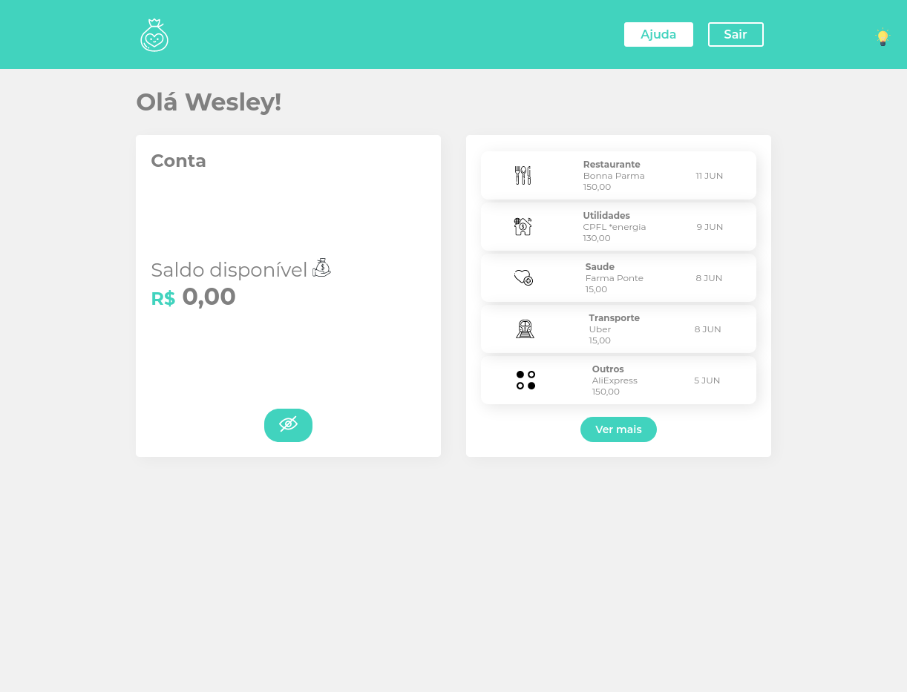
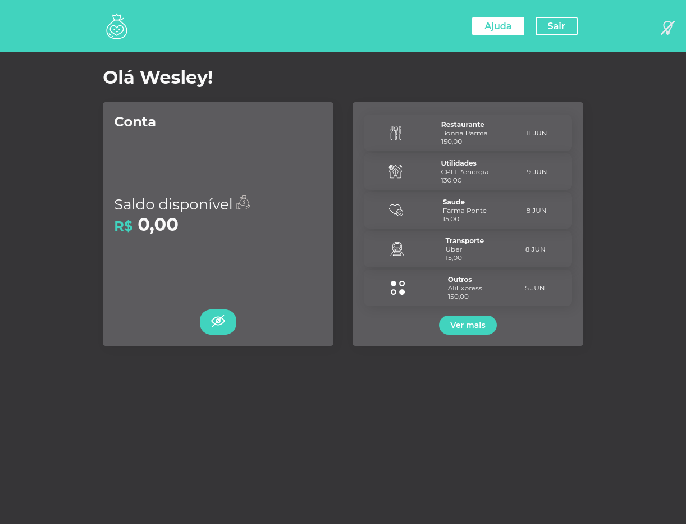

<div >
  
</div>

<p align="center">
	<a href="https://www.linkedin.com/in/wesley-andrade/">	
		
	</a>
	<a href="https://choosealicense.com/licenses/mit/">	
		
	</a>
</p>

<p align="center">
  <a href="#projeto">Projeto</a>&nbsp;&nbsp;&nbsp;|&nbsp;&nbsp;&nbsp;
  <a href="#layout">Layout</a>&nbsp;&nbsp;&nbsp;|&nbsp;&nbsp;&nbsp;
  <a href="#tecnologias">Tecnologias</a>&nbsp;&nbsp;&nbsp;|&nbsp;&nbsp;&nbsp;
  <a href="#instalação">Instalação</a>&nbsp;&nbsp;&nbsp;|&nbsp;&nbsp;&nbsp;
  <a href="#bookmark_tabs-certificados">Certificados</a>&nbsp;&nbsp;&nbsp;|&nbsp;&nbsp;&nbsp;
  <a href="#page_with_curl-licencia">Licencia</a>
</p>

## Projeto

O Smart Bank é um projeto idealizado pela 
<a href="https://alura.com.br/"> **Alura** </a> 
com a intensão de criar uma interface de banco.

Assuntos abordados:

    Conflitos CSS
    Styled Components 
    Estilos globais
    Herança dentro dos componentes


## Layout
<div style="display: flex; flex-direction: 'row'; align-items: 'center';">
				
</div>
<div style="display: flex; flex-direction: 'row'; align-items: 'center';">
			
</div>


## Tecnologias

- [Javascript](https://www.javascript.com/)
- [React](https://reactjs.org)

## Instalação
```bash
# Clone do Repositorio
$ git clone https://github.com/WesleyReboucas/SmartBank.git
```

### Web

```bash
# Na pasta SmartBank
$ cd SmartBank

# Instalação de depedencias
$ yarn install

# Iniciando aplicação
$ yarn start
```
**Acesse:** http://localhost:3000/ 


## :bookmark_tabs: Certificados 

<a href="https://cursos.alura.com.br/certificate/6039993e-f32c-45ef-9069-e919e070128a">
	
</a>


## :page_with_curl: Licencia 
<a href="https://choosealicense.com/licenses/mit/">
	
</a>
Esse projeto está sob a licença MIT. 


---

Feito com ♥ by Wesley Rebouças


